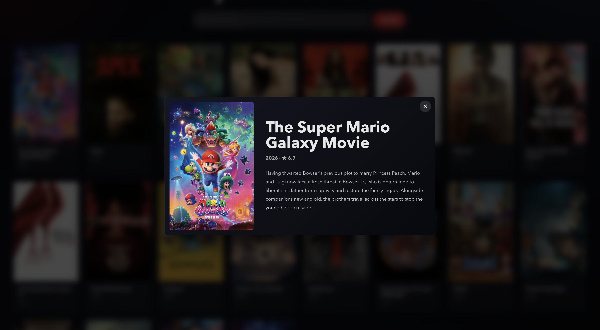

# React Movie Favorites

A small movie discovery app built with React and the TMDB API. It lets users browse popular movies, search by title, and save favorites locally.

[Live Demo](https://react-movie-favorites.vercel.app/)

## Preview





## Features

- Browse popular movies
- Search for movies by title
- Open a movie details modal
- Save and remove favorite movies
- Keep favorites after refresh with `localStorage`
- Navigate between Home and Favorites with React Router

## Tech Stack

- React + Vite
- React Router
- Context API
- TMDB API
- CSS

## Focus

This project focuses on a few core React patterns:

- Component-based UI structure
- API-driven data rendering
- Form state and search handling
- Parent-to-child interaction with a details modal
- Shared favorites state with Context API
- Local persistence with localStorage

## Getting Started

```bash
npm install
```

Create a `.env` file:

```env
VITE_TMDB_API_KEY=your_tmdb_api_key_here
```

Start the development server:

```bash
npm run dev
```

```bash
npm run build
```

## Notes

This project was built while practicing React fundamentals: components, props, state, effects, routing, context, API requests, and local persistence.

This project uses movie data and images provided by [The Movie Database (TMDB)](https://www.themoviedb.org/).
